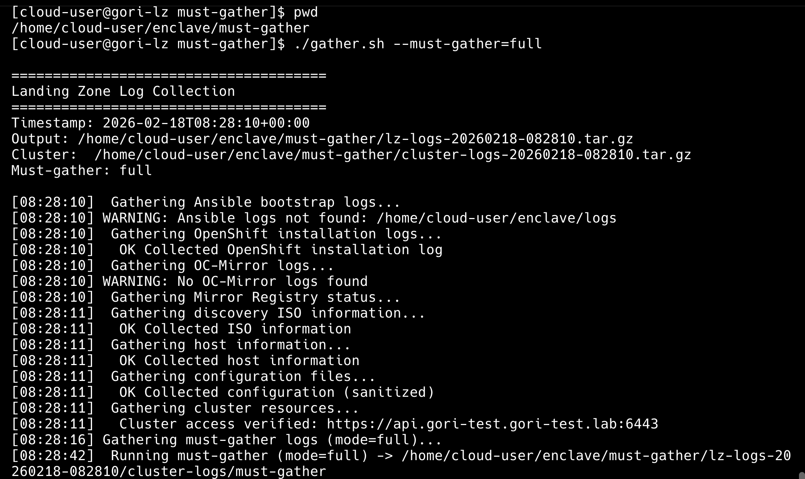
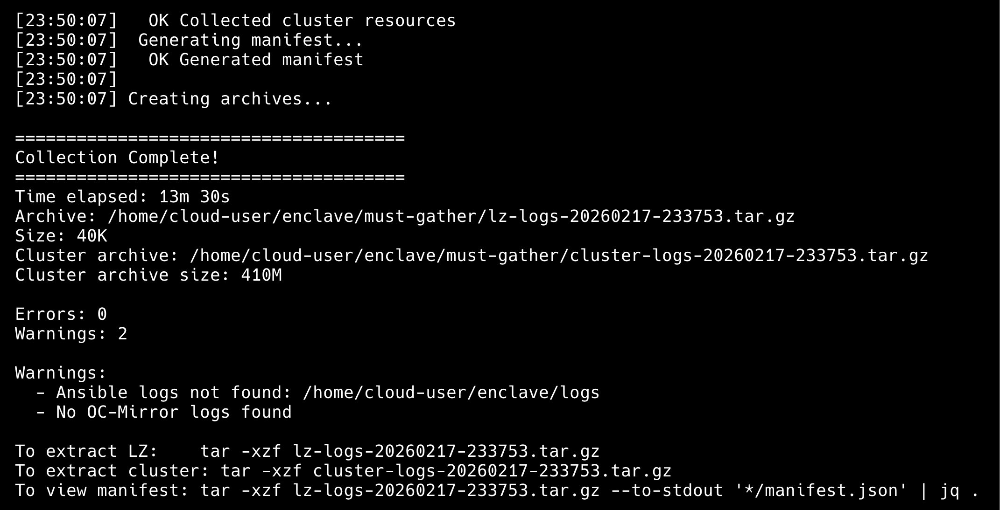

# Landing Zone Log Collection

Diagnostic log collection tool for the Landing Zone (Bastion) host.

**Location**: `scripts/diagnostics/`

## Quick Start

```bash
cd ~/enclave/scripts/diagnostics
./gather.sh
```

The script will:
- Read configuration from `../../config/global.yaml` (default location)
- Use `workingDir` from global.yaml for all log paths
- Create two archives:
  - **LZ logs:** `lz-logs-YYYYMMDD-HHMMSS.tar.gz` (ansible, install, oc-mirror, registry, host, config)
  - **Cluster logs:** `cluster-logs-YYYYMMDD-HHMMSS.tar.gz` (cluster resources and optional must-gather)

## Scripts

| Script | Purpose |
|--------|---------|
| `gather.sh` | Main entry: runs LZ and cluster collection, creates both archives. |
| `gather_lz.sh` | Landing Zone only (ansible, openshift-install, oc-mirror, registry, discovery ISO, host, config). Sourced by `gather.sh`. |
| `gather_cluster.sh` | Cluster resources (nodes, operators, pods, agents, assisted-service) and optional must-gather. Sourced by `gather.sh`, or run directly for must-gather only. |

## Usage

### gather.sh

```bash
./gather.sh [OPTIONS] [GLOBAL_VARS_FILE]
```

**Options**

| Option | Description |
|--------|-------------|
| `--must-gather[=MODE]` | Run must-gather during cluster collection. Output is written into `cluster-logs/must-gather/` and included in the cluster archive. |
| `--help`, `-h` | Show usage and exit. |

**Must-gather modes**

- **`full`** (default when you pass `--must-gather`) — Default OpenShift must-gather (`openshift/must-gather`) plus all operator must-gather plugin images from installed CSVs (e.g. ACM, cluster-logging).
- **`operators`** — Only operator must-gather plugin images (no default OpenShift must-gather).

**Arguments**

- **GLOBAL_VARS_FILE** — Optional path to `global.yaml`. Default: `../../config/global.yaml`.

**Examples**

```bash
# Default: use ../../config/global.yaml, LZ + cluster collection only
./gather.sh

# Use a custom global vars file
./gather.sh /path/to/custom/global.yaml

# Also run full must-gather (default OpenShift + operator plugins)
./gather.sh --must-gather

# Only run operator must-gather plugins (no default must-gather)
./gather.sh --must-gather=operators

# Show usage and options
./gather.sh --help
```

### gather_cluster.sh (standalone)

When run directly, `gather_cluster.sh` only runs must-gather (no cluster resource collection, no LZ). Useful for ad-hoc must-gather without a full LZ run.

```bash
./gather_cluster.sh [OPTIONS]
```

**Options**

| Option | Description |
|--------|-------------|
| `--must-gather[=MODE]` | Run must-gather. `MODE`: `full` or `operators` (same meaning as in `gather.sh`). |
| `--help`, `-h` | Show usage and exit. |

**Examples**

```bash
# Run full must-gather (default OpenShift + operator plugins)
./gather_cluster.sh --must-gather

# Run only operator must-gather plugins
./gather_cluster.sh --must-gather=operators

# Show usage and options
./gather_cluster.sh --help
```

Output is written under `must-gather.local.<timestamp>/` in the current directory, and console output is appended to `must-gather-console.log`.

## Prerequisites

### For Cluster Resource Collection

To collect cluster resources (nodes, operators, agents, etc.), you must be authenticated to the cluster:

```bash
# Option 1: Use existing kubeconfig
export KUBECONFIG=/path/to/kubeconfig

# Option 2: Login to the cluster
oc login https://api.cluster.example.com:6443
```

The script will:
- Verify you have cluster access using `oc whoami`
- Check that you're connected to the correct cluster (matching config/global.yaml)
- Warn if not authenticated or connected to wrong cluster
- Skip cluster resource collection if no access

### For Must-Gather

- Cluster access (as above).
- `oc` and `jq` available; cluster must have CSVs (ClusterServiceVersions) for operator must-gather discovery.
- **Note:** Running must-gather can take quite a while (even tens of minutes or more), especially with multiple operator plugins or a large cluster.

## Obfuscating Sensitive Data (Optional)

To obfuscate sensitive information (IPs, domains, passwords) in the collected logs, use [must-gather-clean](https://github.com/openshift/must-gather-clean) after collection.

## What's Collected

**LZ archive (`lz-logs-*.tar.gz`)**

- Ansible bootstrap logs
- OpenShift installation logs
- OC-Mirror logs
- Quay registry status and logs
- Discovery ISO information
- Host information
- Configuration (sanitized)
- Manifest and version metadata

**Cluster archive (`cluster-logs-*.tar.gz`)**

- Cluster resources (if kubeconfig available): nodes, cluster operators, CSVs, pods not running, agents, InfraEnv, NMStateConfig, BareMetalHosts
- Assisted-service logs
- Optional must-gather output (if `--must-gather` was used): under `cluster-logs/must-gather/`

## Extracting and Inspecting

```bash
# Extract LZ archive
tar -xzf lz-logs-YYYYMMDD-HHMMSS.tar.gz

# Extract cluster archive
tar -xzf cluster-logs-YYYYMMDD-HHMMSS.tar.gz

# View manifest from LZ archive
tar -xzf lz-logs-YYYYMMDD-HHMMSS.tar.gz --to-stdout '*/manifest.json' | jq .
```

## Demo

**Run full must-gather (default OpenShift + operator plugins):**


**Collection complete output:**

